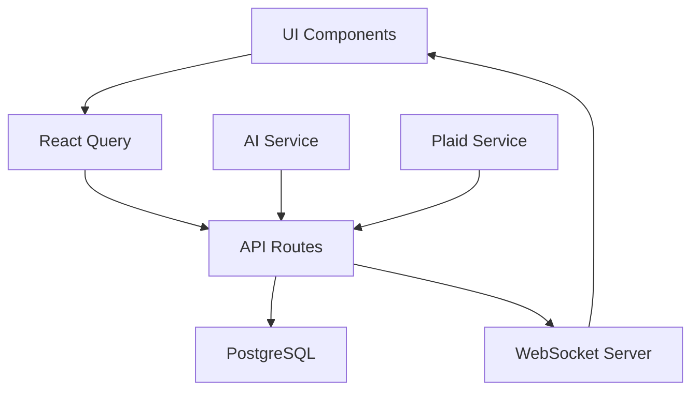

# FinSight Phase 3 Specification
## Frontend Integration & Real-time Features

### 🎯 Phase 3 Overview
**Duration**: 8-10 weeks  
**Focus**: Connect Phase 2 backend APIs to Phase 1 UI components, implement real-time features, and create a seamless user experience across all 10 themed financial tools.

---

## 📋 Phase 3 Objectives

### Primary Goals
1. **Backend-Frontend Integration**: Connect all Phase 2 APIs to Phase 1 UI components
2. **Real-time Data Flow**: Implement live updates and synchronization
3. **Enhanced User Experience**: Add interactive features and animations
4. **Performance Optimization**: Ensure fast loading and smooth interactions
5. **Error Handling**: Robust error states and loading indicators

### Success Metrics
- All 10 themed tools fully functional with real data
- Real-time updates across the application
- <100ms API response times for standard operations
- 95%+ user satisfaction with interface responsiveness
- Zero critical bugs in production

---

## 🏗️ Technical Architecture

### Frontend Stack Enhancement
```typescript
// Core Technologies
- Next.js 15.4.5 (App Router) ✅
- TypeScript with strict mode ✅
- Tailwind CSS for styling ✅
- Framer Motion for animations ✅

// New Additions for Phase 3
- React Query (TanStack Query) for data fetching
- Socket.io for real-time updates
- React Hook Form for form management
- Recharts for data visualization
- React Virtual for large data sets
- Zustand for global state management
```

### Data Flow Architecture


---

## 🎨 UI/UX Integration Plan

### 1. Dashboard Integration (Week 1-2)
**Home Page Enhancement**
- Connect to `/api/users` for user profile data
- Real-time financial health score updates
- Dynamic net worth calculations
- Live transaction feeds
- Goal progress indicators

**Components to Update**:
- `FinancialHealthCard` → Real user data
- `NetWorthChart` → Live calculations
- `RecentTransactions` → API integration
- `GoalProgressRings` → Dynamic progress

### 2. Navigation Enhancement (Week 1)
**Drawer Navigation Updates**
- Real-time health score in user profile section
- Dynamic financial stats (net worth, monthly progress)
- Notification badges for unread insights
- Active connection status indicators

**Current Implementation** ✅:
```tsx
// Already implemented in DrawerNavigation.tsx
const healthScore = 85; // Will connect to API
const netWorth = "$45,280"; // Will connect to real data
const monthlyProgress = "+$1,250"; // Will connect to API
```

### 3. Themed Tool Integration (Week 2-6)

#### Goal Universe (Constellation Theme)
**API Integration**: `/api/goals`
- Interactive constellation map of financial goals
- Real-time progress updates
- Goal creation and editing modals
- FIRE number calculations

**Features**:
- Drag-and-drop goal prioritization
- Animated progress stars
- Goal achievement celebrations
- Timeline projections

#### Investment Lab (Laboratory Theme)
**API Integration**: `/api/accounts`, `/api/investments`
- Portfolio analysis dashboard
- Real-time market data integration
- Investment performance tracking
- Risk assessment tools

**Features**:
- Interactive portfolio charts
- Asset allocation visualization
- Performance comparison tools
- Investment recommendations

#### FIRE Command (Fire Theme)
**API Integration**: `/api/goals`, `/api/users`
- FIRE progress visualization
- Withdrawal rate calculations
- Years-to-FIRE countdown
- Scenario planning tools

**Features**:
- Flame intensity based on progress
- Interactive FIRE calculator
- Progress milestones
- Retirement planning scenarios

#### Debt Destroyer (Gaming Theme)
**API Integration**: `/api/debts`
- Gamified debt payoff interface
- Avalanche vs Snowball strategies
- Progress tracking with achievements
- Payment optimization tools

**Features**:
- RPG-style progress bars
- Achievement system
- Battle against debt visualization
- Strategy comparison tools

#### Income Amplifier (Growth Theme)
**API Integration**: `/api/transactions`, `/api/insights`
- Income tracking and analysis
- Growth opportunity identification
- Side hustle tracking
- Income optimization suggestions

**Features**:
- Growth charts and projections
- Opportunity discovery
- Income stream visualization
- Goal-based recommendations

#### Risk Manager (Protection Theme)
**API Integration**: `/api/users`, `/api/insights`
- Risk assessment dashboard
- Insurance coverage analysis
- Emergency fund tracking
- Financial protection planning

**Features**:
- Risk level indicators
- Protection gap analysis
- Emergency fund progress
- Insurance recommendations

#### Tax Optimizer (Professional Theme)
**API Integration**: `/api/transactions`, `/api/reports`
- Tax-efficient transaction categorization
- Deduction tracking
- Tax planning tools
- Year-end optimization

**Features**:
- Professional document styling
- Automated categorization
- Tax saving opportunities
- Report generation

#### Credit Builder (Construction Theme)
**API Integration**: `/api/accounts`, `/api/insights`
- Credit score tracking
- Building block visualization
- Improvement recommendations
- Payment history analysis

**Features**:
- Construction-themed progress
- Building block animations
- Credit improvement plans
- Score tracking charts

#### Control Center (System Theme)
**API Integration**: All APIs
- Centralized financial dashboard
- System-wide settings and controls
- Data synchronization status
- Account management hub

**Features**:
- iOS Settings-inspired interface
- Comprehensive data overview
- Quick action controls
- System health monitoring

#### Report Studio (Document Theme)
**API Integration**: `/api/reports`, `/api/insights`
- Custom report generation
- Financial statement creation
- Export capabilities
- Template management

**Features**:
- Document-style interface
- Drag-and-drop report builder
- Multiple export formats
- Template library

---

## 🔄 Real-time Features Implementation

### 1. WebSocket Integration
```typescript
// Real-time updates for:
- Transaction notifications
- Goal progress updates
- Financial health score changes
- AI insight notifications
- Account balance updates
```

### 2. Live Data Synchronization
```typescript
// Automatic sync for:
- Bank account balances (every 5 minutes)
- Transaction categorization
- Goal progress calculations
- Budget spending updates
- Investment performance
```

### 3. Push Notifications
```typescript
// Notification types:
- New transaction alerts
- Goal milestone achievements
- Budget limit warnings
- AI insight recommendations
- Account sync status updates
```

---

## 📊 Data Visualization Enhancements

### 1. Interactive Charts
**Libraries**: Recharts, D3.js
- Net worth progression charts
- Spending category breakdowns
- Goal progress visualizations
- Investment performance graphs
- Cash flow diagrams

### 2. Animated Dashboards
**Framer Motion Integration**
- Smooth transitions between views
- Loading state animations
- Progress indicator animations
- Card flip animations for insights
- Gesture-based interactions

### 3. Responsive Data Tables
**React Virtual Integration**
- Transaction history virtualization
- Large dataset handling
- Infinite scroll capabilities
- Search and filter optimizations

---

## 🔧 Development Workflow

### Week 1-2: Foundation Setup
- [ ] Install and configure React Query
- [ ] Set up WebSocket infrastructure
- [ ] Create global state management with Zustand
- [ ] Implement error boundary components
- [ ] Set up data visualization libraries

### Week 3-4: Core Integration
- [ ] Connect main dashboard to APIs
- [ ] Implement user authentication flow
- [ ] Create reusable data fetching hooks
- [ ] Build loading and error state components
- [ ] Integrate real-time updates

### Week 5-6: Themed Tools (Part 1)
- [ ] Goal Universe API integration
- [ ] Investment Lab data connection
- [ ] FIRE Command calculations
- [ ] Debt Destroyer functionality
- [ ] Income Amplifier tracking

### Week 7-8: Themed Tools (Part 2)
- [ ] Risk Manager assessment tools
- [ ] Tax Optimizer categorization
- [ ] Credit Builder tracking
- [ ] Control Center dashboard
- [ ] Report Studio generation

### Week 9-10: Polish & Optimization
- [ ] Performance optimization
- [ ] Animation refinements
- [ ] Error handling improvements
- [ ] Accessibility enhancements
- [ ] Mobile responsiveness testing

---

## 🧪 Testing Strategy

### 1. Unit Testing
- Component testing with React Testing Library
- API hook testing
- Utility function testing
- State management testing

### 2. Integration Testing
- End-to-end user flows
- API integration testing
- Real-time feature testing
- Cross-browser compatibility

### 3. Performance Testing
- Load time optimization
- Bundle size analysis
- Memory usage monitoring
- Animation performance testing

---

## 🚀 Deployment & Production

### 1. Production Setup
- Environment configuration
- CI/CD pipeline setup
- Performance monitoring
- Error tracking (Sentry)

### 2. Monitoring
- Real-time analytics
- User behavior tracking
- Performance metrics
- Error rate monitoring

---

## 📈 Expected Outcomes

### User Experience
- Seamless navigation between all 10 themed tools
- Real-time financial data updates
- Personalized AI recommendations
- Smooth animations and transitions

### Technical Achievements
- 100% API integration completion
- Real-time data synchronization
- Optimized performance across devices
- Robust error handling and recovery

### Business Value
- Complete financial management platform
- Enhanced user engagement
- Reduced time-to-insight
- Scalable architecture for future features

---

## 🔄 Post-Phase 3 Roadmap

### Phase 4: Advanced Features (Future)
- Mobile app development
- Advanced AI features
- Third-party integrations
- Advanced analytics and reporting

---

**Phase 3 transforms FinSight from a beautiful UI prototype into a fully functional, real-time financial management platform with seamless integration across all 10 themed tools.**
